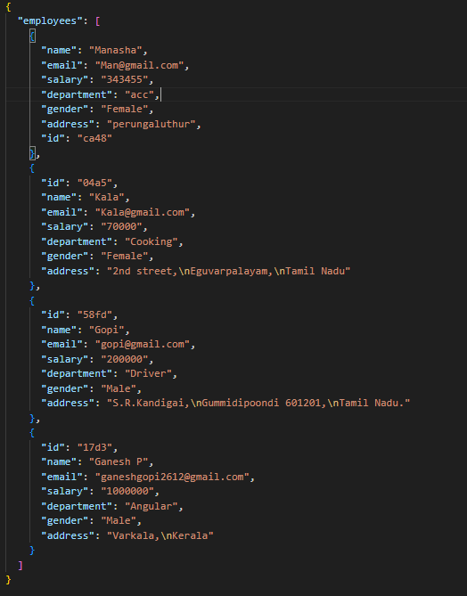
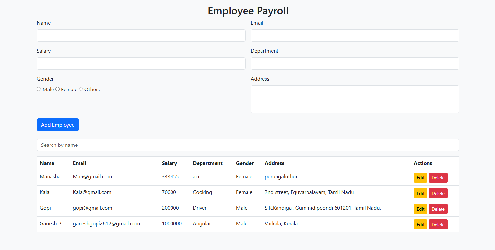

# Payroll-App

 Features :

✅ Add New Employees with Real-Time Validation

✏️ Edit Existing Employee Details

🗑️ Delete Employee Records with Confirmation

🔍 Search Employees by Name

📱 Responsive Design for Desktop and Mobile Devices

📡 Backend Integration with JSON Server (Fake REST API)

Install JSON Server Globally (if not already installed):

- npm install -g json-server

Start the JSON Server:

- json-server --watch db.json --port 

ScreenShot :

